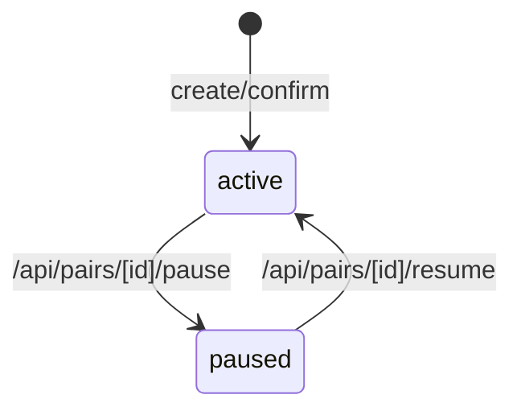
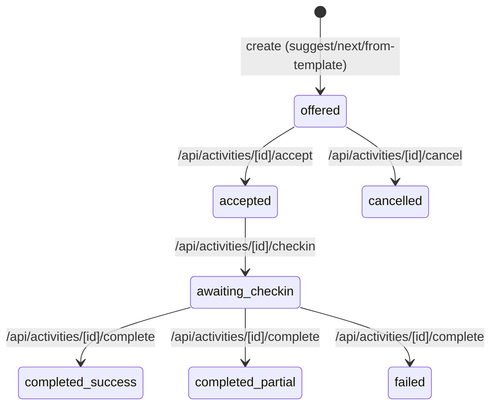
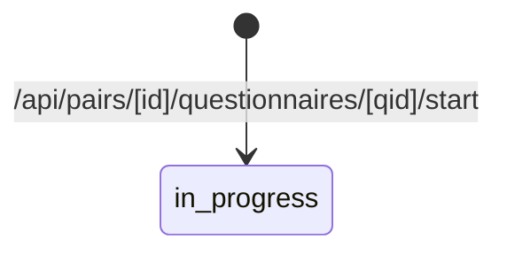

**Как Сейчас (Обзор)**
1. Pair status допускает `active | paused | ended` (enum в модели). Переходы, реализованные в роутерах: `active > paused` и `paused > active`, а также создание пары со статусом `active`. Доказательства: `src/models/Pair.ts:18,57`, `src/app/api/pairs/[id]/pause/route.ts:8-13`, `src/app/api/pairs/[id]/resume/route.ts:8-13`, `src/app/api/pairs/create/route.ts:73-79`, `src/app/api/match/confirm/route.ts:121-126`.
2. PairActivity status допускает `suggested | offered | accepted | in_progress | awaiting_checkin | completed_success | completed_partial | failed | expired | cancelled`. В коде явно устанавливаются: `offered` (создание инстанса), `accepted`, `awaiting_checkin`, `completed_success|completed_partial|failed`, `cancelled`. Доказательства: `src/models/PairActivity.ts:47-49`, `src/app/api/pairs/[id]/suggest/route.ts:41-63`, `src/app/api/pairs/[id]/activities/from-template/route.ts:31-55`, `src/app/api/activities/next/route.ts:103-134`, `src/app/api/activities/[id]/accept/route.ts:14-16`, `src/app/api/activities/[id]/checkin/route.ts:18-24`, `src/app/api/activities/[id]/complete/route.ts:22-26`, `src/app/api/activities/[id]/cancel/route.ts:11-13`.
3. Для списка активностей пары текущими считаются статусы `accepted | in_progress | awaiting_checkin`, а историческими — `completed_success | completed_partial | failed | cancelled | expired`. Доказательства: `src/app/api/pairs/[id]/activities/route.ts:19-32`.
4. PairQuestionnaireSession status допускает `in_progress | completed`; старт сессии создаёт `in_progress`. Доказательства: `src/models/PairQuestionnaireSession.ts:9-23`, `src/app/api/pairs/[id]/questionnaires/[qid]/start/route.ts:39-45`.

**State Machines (Observed)**

**Evidence**
| Факт | Тип | Источник (path:line) | Цитата (?2 строки) |
|---|---|---|---|
| Pair status enum | model | `src/models/Pair.ts:18` | `status: 'active' | 'paused' | 'ended';` |
| Pair schema enum и default | model | `src/models/Pair.ts:56-57` | `status: { type: String, enum: ['active', 'paused', 'ended'], default: 'active' },` |
| Пауза пары | api | `src/app/api/pairs/[id]/pause/route.ts:8-12` | `const doc = await Pair.findByIdAndUpdate(id, { $set: { status: 'paused' } }, { new: true });` |
| Возобновление пары | api | `src/app/api/pairs/[id]/resume/route.ts:8-12` | `const doc = await Pair.findByIdAndUpdate(id, { $set: { status: 'active' } }, { new: true });` |
| Создание пары со статусом active | api | `src/app/api/pairs/create/route.ts:73-77` | `const pair = await Pair.create({` `  members, key, status: 'active',` |
| Confirm пары ставит status active | api | `src/app/api/match/confirm/route.ts:121-126` | `const pair = await Pair.findOneAndUpdate(` |
| PairActivity status enum | model | `src/models/PairActivity.ts:47-49` | `status:` `  | 'suggested' | 'offered' | 'accepted' | 'in_progress' | 'awaiting_checkin'` |
| Offered при suggest | api | `src/app/api/pairs/[id]/suggest/route.ts:41-63` | `status: 'offered',` |
| Offered при from-template | api | `src/app/api/pairs/[id]/activities/from-template/route.ts:50-55` | `status: 'offered',` |
| Offered при /api/activities/next | api | `src/app/api/activities/next/route.ts:124-133` | `status: 'offered',` `createdBy: 'system',` |
| Accept > accepted | api | `src/app/api/activities/[id]/accept/route.ts:14-16` | `doc.status = 'accepted';` `doc.acceptedAt = new Date();` |
| Cancel > cancelled | api | `src/app/api/activities/[id]/cancel/route.ts:11-13` | `findByIdAndUpdate(id, { $set: { status:'cancelled' } }, { new:true });` |
| Checkin > awaiting_checkin | api | `src/app/api/activities/[id]/checkin/route.ts:18-23` | `act.answers = act.answers || [];` `act.status = 'awaiting_checkin';` |
| Complete > completed_* / failed | api | `src/app/api/activities/[id]/complete/route.ts:22-25` | `let status:'completed_success'|'completed_partial'|'failed' = 'completed_partial';` |
| Current/history buckets | api | `src/app/api/pairs/[id]/activities/route.ts:19-32` | `q.status = { $in: ['accepted', 'in_progress', 'awaiting_checkin'] };` |
| PairQuestionnaireSession status enum | model | `src/models/PairQuestionnaireSession.ts:9-23` | `status: 'in_progress' | 'completed';` |
| Start session sets in_progress | api | `src/app/api/pairs/[id]/questionnaires/[qid]/start/route.ts:39-45` | `status: 'in_progress',` |

**Гипотезы/Риски/Куда Идём**
- Ввести явные диаграммы переходов и запреты для статусов `ended`, `suggested`, `expired`, `completed` (сейчас переходы не описаны в коде).
- Добавить идемпотентность для мутаций статуса (accept/cancel/checkin/complete).
