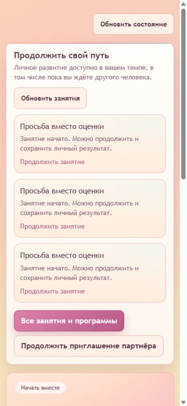
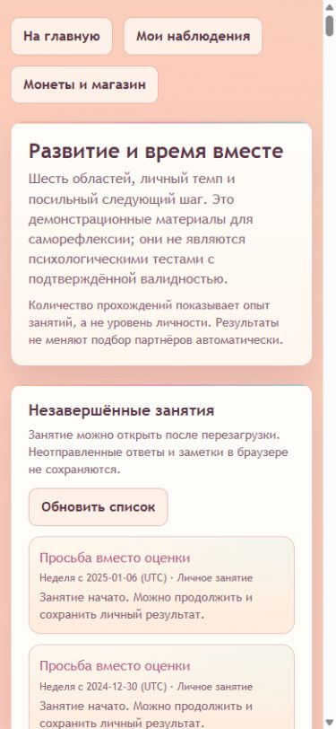
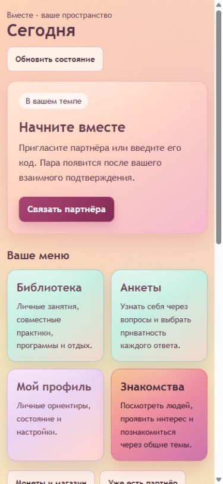
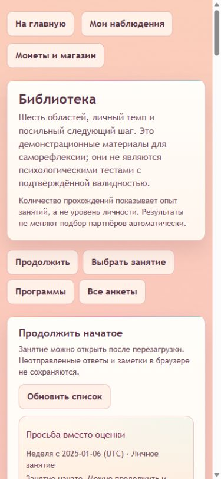
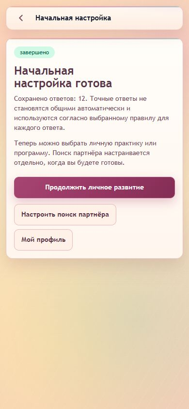

# Реализация и приёмка UX/UI — 2026-09-07

> Уточнение 2026-09-09: владелец сообщил о неработающих/непонятных переходах уведомлений, недоступном первом маршруте поиска партнёра, знакомствах для пользователей в отношениях и непонятном главном блоке. Ниже сохранён датированный отчёт прежних локальных проверок; он не подтверждает полную продуктовую готовность. Новая постановка, проверенные кодовые факты и критерии исправления находятся в [задаче продолжения](PRODUCT_FLOW_CONTINUATION_PROMPT.md). Подготовленные прежде fixtures не покрывали первый выбор маршрута действительно нового пользователя.

## Объём и решения

Режим: `FEATURE_CHANGE`, последовательные изменения отдельных потоков из [плана](UX_UI_IMPLEMENTATION_PLAN.md). По прямому ответу владельца сохранено привычное меню карточек; новая общая панель вкладок не вводится. Главная называется «Сегодня», совместное пространство открывается через «Мы». Группировка библиотеки делегирована владельцем исполнителю: продолжения, выбор «Для себя / Вместе», форматы и область, каталог, компактные программы.

Новые зависимости, схемы БД, маршруты HTTP, правила сессий, согласий, раскрытия и формирования пары не вводятся. Анимационный пилот — локальное появление общего диалога на CSS; установка Motion/GSAP не требуется. Жизненный цикл Discord bootstrap и server root layout сохранены.

На финальной визуальной сверке с главной сняты прежняя фиксированная высота hero 30rem и двойной padding. Карточка следующего шага занимает высоту своего содержимого. Сразу за ней расположено привычное меню; уведомления и продолжения идут ниже, поэтому длинная история занятий не отодвигает навигацию.

## Воспроизводимая исходная версия

- Исходный HEAD: `e7674e0923dd473d2315882a8316db1517dc3652`.
- До реализации изменены только пользовательские документы: `CHANGELOG.md`, `INDEX.md`, `PRODUCT_IMPLEMENTATION.md`, `RELEASE_RUNBOOK.md`, `TWO_USER_ACCEPTANCE.md`; `UX_UI_IMPLEMENTATION_PLAN.md` был новым файлом. Эти изменения сохранены.
- Для baseline создана отдельная исходная копия `C:/Users/Admin/Videos/foreverApp-ux-baseline`, detached HEAD, без runtime `.env`. После сохранения снимков и проверки чистого git status временный worktree штатно удалён; основной и ранее существовавшие worktrees сохранены.
- Установленные зависимости скопированы без изменения lockfile. Первая попытка с junction была отклонена Turbopack (`Symlink points out of filesystem root`); после обычного копирования `npm run build` прошёл.
- Browser harness: отдельные синтетические A/B, EXISTING_PARTNER после onboarding, без пары; 35 личных незавершённых занятий А. MongoDB `C:/Users/Admin/AppData/Local/Temp/vmeste-mongo-20260905/mongod.exe`, собственный loopback replica set, штатный `POST /stop`.
- Viewport исходных снимков: 390×844 CSS px. У плиток измерены `animation-name: app-gradient-breathe`, `background-size: auto`. Главный шаг расположен ниже блока продолжений.

## Изменённые потоки

| Этап | Реализация |
| --- | --- |
| 1–2 | [Контраст, общие состояния и действия](UX_UI_FOUNDATION.md): тёмные foreground/background, явный focus, target 44 px, стабильные градиенты, sans для рабочих заголовков |
| 3 | `useTodayDashboard` и чистый `selectTodayAction`: один основной CTA после готовности профиля/пары; lifecycle выше старых рекомендаций; сохранены skipped/recommendation/nextStep, якоря и статус ожидания |
| 4 | Сохранённое меню, заметные «Мы»/общая жизнь, компактные вторичные разделы; переходы к Сегодня, личным занятиям, истории, безопасности, состоянию недели в пространстве пары |
| 5 | Общий нативный Dialog: фокус, Escape, возврат, запрет закрытия во время отправки, один скроллер и блокировка фона; CheckIn — первый потребитель |
| 6, 8 | [Библиотека и общая жизнь](UX_UI_WORKSPACE.md): фильтры/deep links, продолжения и программы, отдельные виды записей, сравнение серверной версии с черновиком при конфликте |
| 7A–D | [Onboarding, приглашения и знакомства](UX_UI_FORMS.md): обязательные ответы и согласия, подтверждённые этапы, независимое раскрытие, composer с проверкой, черновики и безопасный retry |
| 9 | CSS-пилот общего диалога, reduced-motion, без библиотек анимации и без зависимости бизнес-результата от animation callbacks |

## Проверенные пользовательские сценарии

Среда: production Next.js, Codex In-app Browser / Chromium, две подписанные синтетические сессии и отдельный MongoDB replica set. Браузерные действия выполнялись через обычный интерфейс. Данные в снимках синтетические.

| Поток | Фактический результат |
| --- | --- |
| Сегодня | Ровно один основной CTA; существующий партнёр без пары, Solo с продолжениями и пустой Solo; confirmed paused ведёт к состоянию пары. Главный шаг выше продолжений. Шесть измеренных размеров: 320/360/390/430, desktop 1440×1000, landscape 844×390 — без горизонтального переполнения |
| Сессия | Истёкшая сессия показывает вход заново; защищённые продолжения и основной персональный CTA не отображаются |
| Приглашение | А создаёт → Б вводит код → Б подтверждает → А видит требуемое собственное подтверждение → Б видит ожидание → А подтверждает → оба получают созданную пару. Claim не выдан за готовую пару |
| Onboarding | Три явных подтверждения и видимые объяснения policy; все 12 ответов отправлены с PRIVATE, каждый следующий вопрос получает фокус; перезагрузка перед завершением сохраняет прогресс; завершение открывает личное развитие с отдельной настройкой знакомств |
| Библиотека | Сначала три продолжения; раскрытие списка и 30→35 без дублей; формат/область/личный режим сохраняются при открытии и возврате. Старое занятие сохраняет ответ и личную заметку, после reload виден завершённый результат |
| Совместная практика | Ответ А даёт partial; ответ Б даёт final; А после обновления/перезагрузки видит final. Каждый видит только свою заметку. Возврат сохраняет scope=together, format=PAIR_PRACTICE, area=communication; фильтры не обрезают список 35 продолжений |
| Composer | Карточка не содержит textarea до «Начать ответ». Девять обязательных реакций; AGAINST на hard boundary блокирует, обычное несогласие допускается. Все три вопроса и три подтверждения обязательны. Возврат сохраняет черновик; успешная отправка фокусирует результат |
| Независимые ответы | До ответа Б его экран содержит только две карточки готовности без текста А. После добровольного ответа Б оба получают раскрытие; А видит его после обновления. Первый ответ обозначен как ожидание, повторный ввод не предлагается |
| Дела | Создание/редактирование/удаление; конкурентный edit409 сохраняет черновик и показывает актуальные поля; до подтверждения сравнения retry недоступен. Конкурентное удаление также требует сравнения |
| Остальные записи | Покупки: количество, ответственность и выполнение; события: повторяющаяся повестка; бюджет: раздельные итоги KZT/RUB; цели: 1/2→2/2 и завершение; воспоминания: порядок дат и HTTPS-ссылка |
| Настройки общей жизни | Изменение даты и параллельное изменение партнёром →409; введённая дата сохраняется, явное подтверждение позволяет повторить запись |
| Диалог | На 390 px: заголовок получает фокус, Tab/Shift+Tab остаются внутри, чистый Escape закрывает, фокус возвращается к trigger; wheel не прокручивает фон, после закрытия overflow восстанавливается |

В ходе QA исправлены две воспроизведённые потери фокуса: закрытие отправленной карточки с удалённым trigger теперь использует явный fallback h1; сохранение независимого ответа фокусирует видимый summary, открытие нового раунда — textarea. На пересобранном приложении summary и textarea проверены повторно: PASS. Совет перезагрузить страницу при конфликте общей жизни заменён инструкцией сравнить версии и сохранить черновик; повторный настоящий 409 подтвердил новую копию, сохранность ввода, блокировку записи до сравнения и успешный retry.

Независимое ревью дополнительно закрыло немедленную очистку Like после подтверждённой блокировки, очистку candidate/feed при отказе доступа и отмену чтения закрытого диалога. Отдельное состояние mutation сохраняет запрет закрытия во время отправки; GET карточки теперь можно отменить. Actual-hook regression проверяет поздние успехи/ошибки, 401/403/404/block и pending mutation после скрытия данных.

## Команды и виды доказательств

- `npm run lint`, `npm run check:types`, `npm run build` — PASS. После последних правок выполнены повторные build/TypeScript и scoped ESLint. Итоговая production-сборка содержит все исправления ревью и компактную главную.
- `npm run check:self` — PASS, все 54 команды агрегата, включая новые actual-hook/component adapters для гонок, диалогов и ухода с черновиком, численный контраст и workspace viewmodels. Отдельный today selector включён через frontend selfcheck. После завершающих matching/главная правок повторно прошли matching-request-race, matching-ui, matching-disclosure и frontend-mvp-ui.
- `npm run check:agents:changed` — 0 errors, 0 warnings; единственный info напоминает о context budget. Allowlist не изменён.
- `npm run acceptance:local -- --mongod <проверенный абсолютный путь>` — все шесть интеграционных наборов прошли на новом изолированном replica set: onboarding, matching social, matching pair transition, two-user MVP, remaining lifecycle, product workspace. Runtime auth, API и server services этой поставкой не менялись.
- Локальный browser harness расширен фиксированными scenario/prefix только для воспроизводимой приёмки. Команды и границы описаны в [LOCAL_ACCEPTANCE.md](LOCAL_ACCEPTANCE.md).
- `git diff --check` и проверка локальных ссылок документации — PASS. [Полный состав изменённых файлов](UX_UI_FILES.md) выделяет пользовательские правки, существовавшие до этой задачи.

Заключительный браузерный прогон подтвердил оба вида возврата фокуса Dialog: до отправки — на сохранившуюся кнопку карточки, после отправки и удаления карточки — на h1 ленты. Закрытие во время чтения доступно. Результат отправки и повторное открытие проверены через настоящий production transport.

## Точные границы результата

Открытых отложенных этапов реализации 1–9 нет. Изменения находятся в рабочей копии, публикация не выполнялась. Новые зависимости, lockfile, env-контракт, публичный HTTP/DTO, MongoDB schema и миграции отсутствуют. Пользовательские изменения документации сохранены.

Все созданные browser/integration harness завершились `cleaned-up`; их Next/MongoDB-процессы и собственные временные данные удалены. Временные viewport overrides сброшены. Финальная компактная главная повторно измерена на всех шести размерах (`home-responsive-final.json`): один основной CTA, без переполнения, меню начинается сразу после следующего шага. Широкий снимок: [after-home-desktop.png](evidence/ux-ui-2026-09-07/after-home-desktop.png).

Приведённая локальная приёмка не удостоверяет настоящий Discord OAuth/SDK iframe, Android/iOS, физическую экранную клавиатуру, screen reader или PIP/grid. Для них в этой среде нет подключённых устройств и авторизованного Discord-приложения. CSS reduced-motion и safe-area проверены как код; это не измерение поведения всех устройств.

Нативное предупреждение об уходе с черновиком действительно вызывалось в browser host, но CUA не предоставил управляемый JsDialog для надёжной проверки отказа. Отказ, согласие, pending, несколько форм, browser traversal и cleanup проверены исполнением настоящего hook на детерминированных событиях. Неподтверждённый native cancel-flow не отмечен как browser PASS. За пределами Chromium без Navigation API остаются guards ссылок/Back приложения/beforeunload; нативный same-document Back ограничен возможностями хоста.

Измерения ширин главной находятся в `evidence/ux-ui-2026-09-07/home-responsive.json`. Первоначальный повторный цикл библиотеки фактически оставался на 390 px несмотря на запросы других размеров: старый `library-responsive.json` не является доказательством иных ширин. Причина — viewport capability меняет выбранную вкладку, а фоновые вкладки сохраняют предыдущий размер. После выбора единственной проверяемой вкладки выполнен полный повтор: `library-responsive-final.json`, `connection-responsive.json`, `dialog-responsive-final.json` подтверждают фактические 320/360/390/430, 844×390 и 1440×1000. Переполнения у видимых потомков нет; диалог полностью внутри viewport на всех шести размерах.
